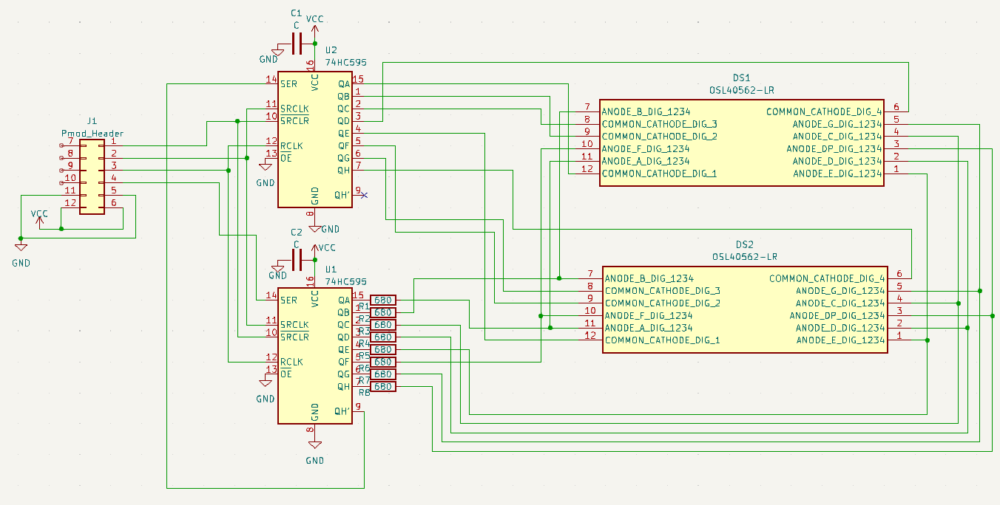

# BOM

部品 | 説明 | 数量
---|---|---
angle double pin header | Pmod header | 1
74HC595 | shift register | 2
OSL40562-ARA | 7seg LED x 4digit | 2
0603 SMD Register | chip register 680Ω | 8
0603 SMD Capaciter | chip capaciter 10μF | 2

# 電気図 Schematics
