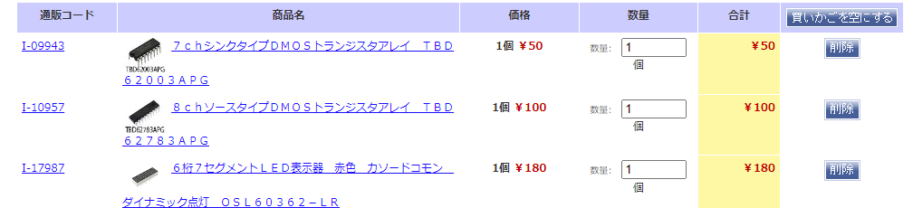
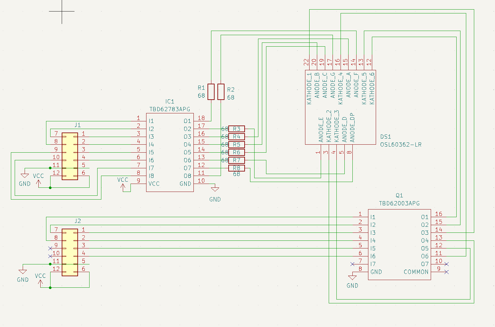
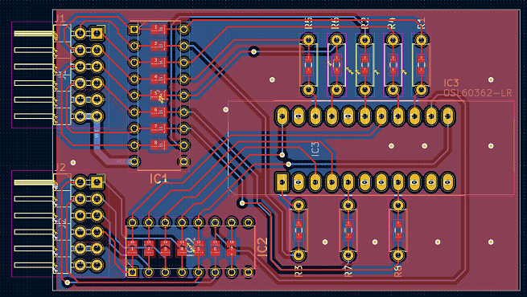

# Pmod_7Seg
  

6桁7セグLEDを載せたPmod基板．  
Pmodを2ポート使う  
1ポート目にはAnode側のデータを，2ポート目にはカソード側のデータを送る．  
それぞれのポートにパラレルでデータ送信し，トランジスタアレイを介して6桁の7セグLEDをダイナミック駆動できるようになっている．  
シフトレジスタを使っていないので，シンプルで分かりやすい制御が可能．  

PCBは2個取りした面付けデータがkikitディレクトリにあります．  

# BoM

電流制限抵抗はお好みで（470Ω程度？）

# Schematics

# 実装例
