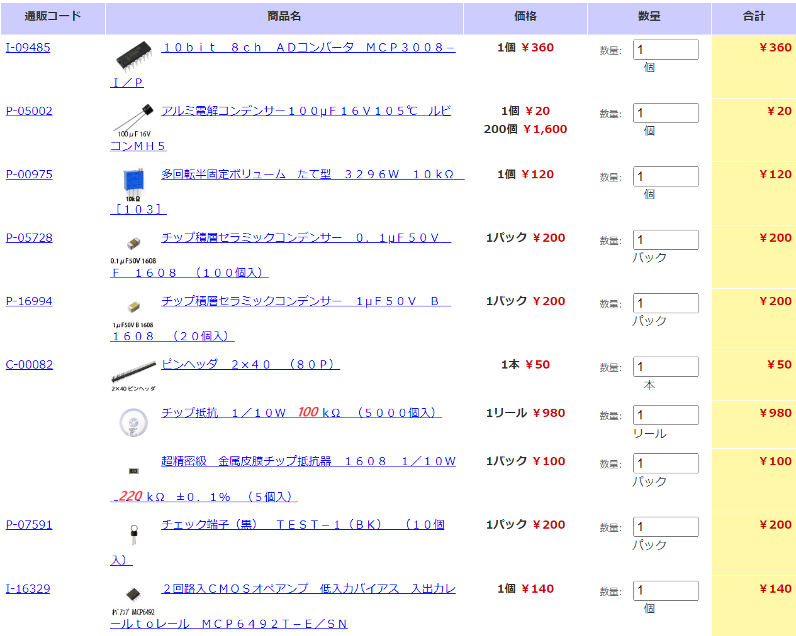

KiCADで作ったPCBデータです．
Pmodに対応したA-Dコンバータ基板です．  

# Pmod_ADC
8チャネルのADコンバータ・チップ MCP3008/3208をPmodで使うボード．  
8チャネルのアナログ信号を入力できます．  
チャネル1（ch1）については，テストピンもしくはPhone Jackからも入力できます．  

# BoM
網羅はできていませんが，だいたいこんなものがあればよいのではないでしょうか．  

1806抵抗：22Ω，22kΩ，47kΩ  

部品(Item) | 説明 | 数量(Qauntity)
---|---|---
MCP6492T-E/SN | オペアンプ | 1
TEST-1 | テスト端子 | 2
金属皮膜チップ抵抗器 220kΩ | 金属皮膜チップ抵抗器1608 1/10W ±0.1% | 2
チップ抵抗 100kΩ | チップ抵抗 1/10W 100k | 3
チップ抵抗 22kΩ | チップ抵抗 1/10W 22k | 2
チップ抵抗 47kΩ | チップ抵抗 1/10W 47k | 2
チップ抵抗 22Ω | チップ抵抗 1/10W 22 | 2
チップ抵抗 10kΩ | チップ抵抗 1/10W 10k | 2（オプション）
ピンヘッダ | アングル・ピンヘッダ　ダブル(2x6) | 1
チップコンデンサ 1uF | 積層セラミックコンデンサ 1uF50V 1608 | 4
チップコンデンサ 1uF | 積層セラミックコンデンサ 0.1uF25V 1608 | 2
半固定ボリューム | 縦型 3296W 10k | 1（オプション）
電解コンデンサ | 電解コンデンサMH5 100uF16V | 1
MCP3008-I/P | 10bit 8ch A-Dコンバータ | 1

# Schematics

