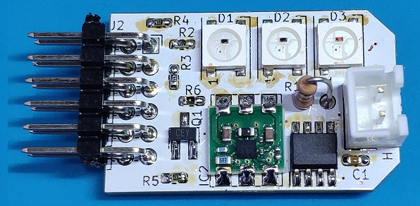
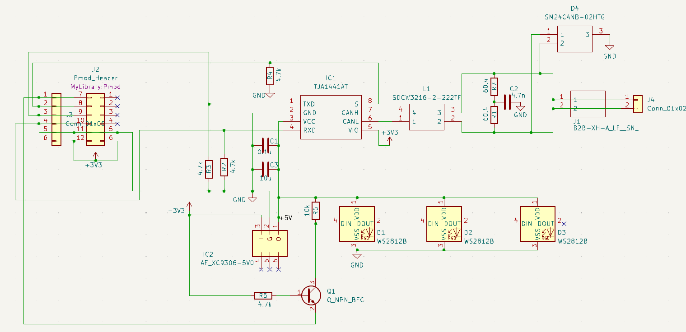

# Pmod CAN V2

# Schematics

# BoM

部品(Item) | 内容 | 数量(Qauntity)
--|--|--
チップ抵抗 | 1608 4.7K | 4 | LED(1)，CAN(3)
チップ抵抗 | 1608 10K | 1 | LED
チップ抵抗 | 1608 1/3W 60.4 | 2 | CAN
チップコンデンサ| 1608 0.1μ | 1 | CAN
チップコンデンサ| 1608 10μ | 1 | CAN
チップコンデンサ| 1608 4.7n | 1 | CAN
LED | WS2812B (I-07915) | 3| LED
チップトランジスタ | 2SC3325-Y(I-00628) | 1| LED
AE-XC9306-5V0(秋月) | 昇降圧DC-DCコンバータ | 1 | LED/CAN
ピンヘッダ | アングル・ピンヘッダ(2x6) | 1 | LED/CAN
CANトランシーバ | TJA1441AT(NXP) | 1 | CAN
TVS | | CAN
コモンモードチョークコイル | SDCW3216-2-222TF | CAN
# Sample
　sampleディレクトリにサンプルのFPGA用プロジェクトが入っています．
