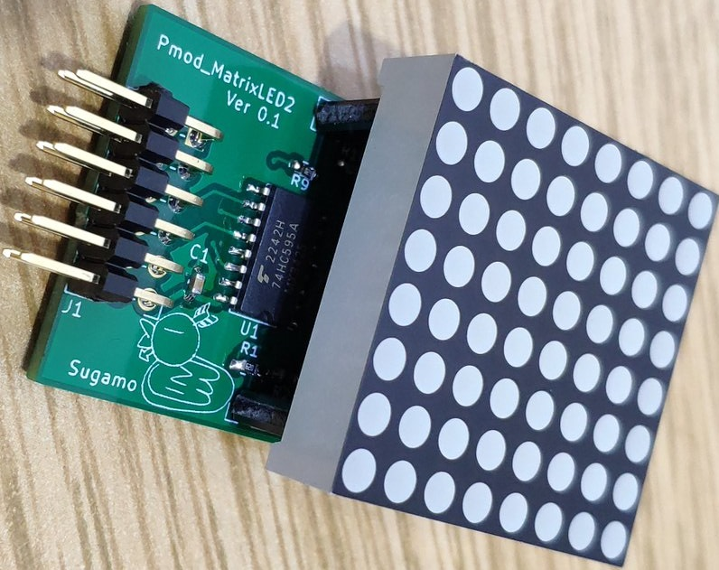

# Pmod_MatrixLED2
8×8　2色マトリクスLEDのモジュールです．  
コネクタのピン配置はPmod互換ですが，
基板の幅がPmodの規格に入っていないので，なんちゃってPmodです．

# BOM
アイテム（Item）|個数（Quantity）
---|---
74HC595 | 3
1608チップコンデンサ0.1μF capacitor | 3
1608チップ抵抗22Ω Register | 16
L型ダブルピンヘッダ（6列）L-2x6pinheader | 1
2色LEDMatrix LTP-12188M-08 | 1
ピンソケット 1x12 | 1（オプション）
