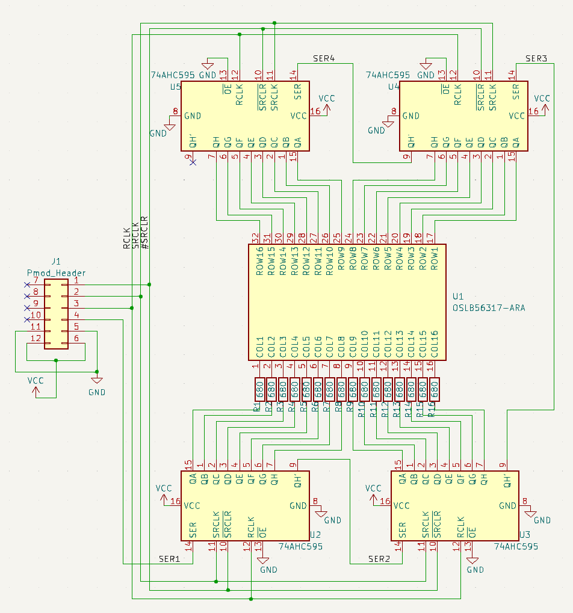

# BOM

部品 | 説明 | 数量
---|---|---
angle double pin header | Pmod header | 1
74HC595 | shift register | 4
OSLB56317-ARA | MatrixLED 16x16 赤 | 1
0603 SMD Register | chip register 680Ω | 16

# 電気図 Schematics
