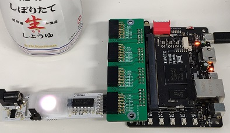

# Pmod Power_ColorLED
　Pmod規格に準拠したマイコン/FPGAボード用拡張基板です．  
 KiCADのプロジェクトになっています．  
 ガーバーの最終出力は面付け（4つ取り）してあり，kikitディレクトリに入っています．  
 アルミの片面基板を想定しており，JLCPCBで制作後，動作確認してあります．

# BOM
一部は汎用部品ですが無理やり表面実装します．  

## TBD62064APG
東芝のトランジスタアレイです．電流に余裕のあるDIPを選定．

## SS2040FL ショットキダイオード
RGBのうち，RだけVfが低いのでバランス取りとして入れています．  
RGB間の出力もPWMで調整する場合は，ソルダージャンパ直結でヨシッ！

## 外部電源
電源はPmod（Vcc）とDCジャック（ExVcc）から選択できます．  
どちらを使うかはピンヘッダ（3pin）で選択できるようにしてあります．  
片方のみを使用する場合は，ピンヘッダを実装せずに基板上で直結（3pinの'Vcc'と'中央のピン'）してもよいでしょう．

### AZ1117-3.3
DCレギュレータです．
電源としてPmodのVccのみを使う場合は，実装する必要はありません．  
その場合，基板を折ることで基板長を短くできるようになっています．ﾎﾟｷｯっとな  

# はんだ付け
アルミ基板なので，まぁ付かないです．  
筆者はホットプレート（100℃設定）に基板を置いた状態ではんだこてで手付けしています．  
はんだこてだけでは，かなり厳しいでしょう．  

# サンプルプログラム
Tang Primer 20Kに接続して使うサンプルプログラムです．  
Gowin EDAのプロジェクトになっています．  

