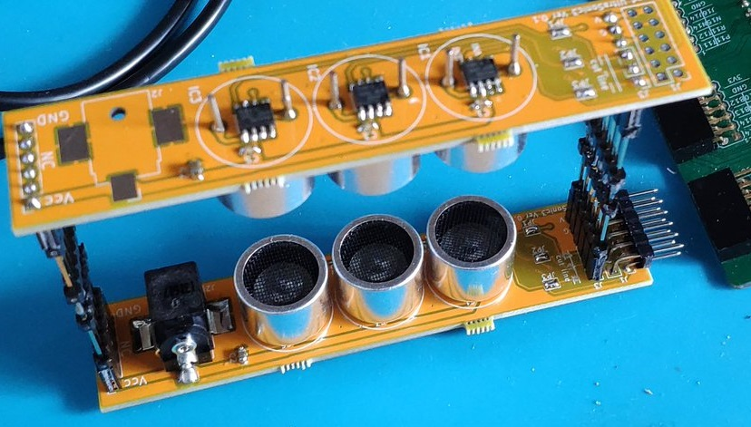
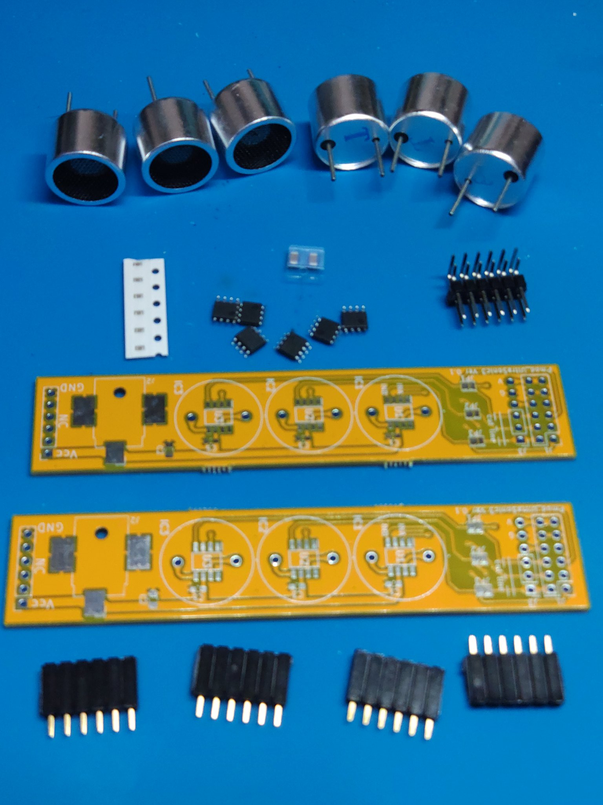

# Playing with Ultra Sonic
超音波浮揚で遊ぶPmodボードです．
2セット使うのがよいです．Upper BoardとLower Boardは同じ生基板を使います（超音波Speakerの取り付け方向が異なる）．

# BoM

部品 | 説明 | 数量
---|---|---
double pin header | Pmod header | 1
IR4428 | Gate Driver IC | 3
DC Jack(SMD) | DC Jack for driving speaker | 1
1608mm SMD Capaciter | chip capaciter 0.1μF V25 | 3
2012mm SMD Capaciter | chip capaciter 10μF V25 | 1