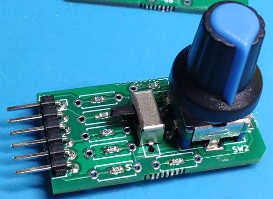
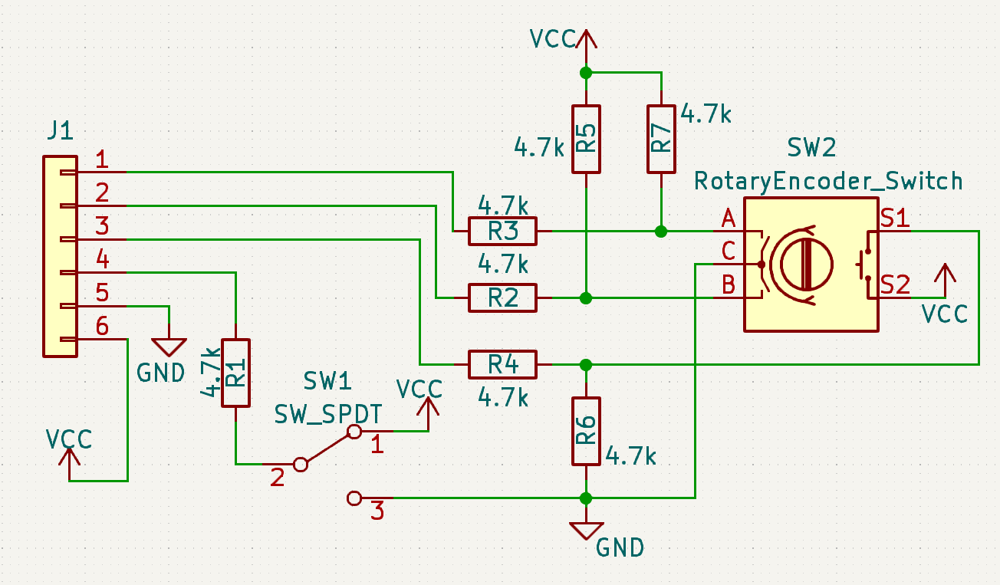

# Pmod Rotary encoder

# Schematics

# BoM

部品(Item) | 内容 | 数量(Qauntity)
--|--|--
チップ抵抗 | 1608 4.7K | 7
ロータリエンコーダ | ロータリエンコーダ　プッシュSW付 | 1
ノブ | ロータリエンコーダ用ノブ | 1（オプション）
スライドスイッチ | スライドスイッチ | 1
ピンヘッダ | アングル・ピンヘッダ(1x6) | 1

# Sample
　sampleディレクトリにサンプルのFPGA用プロジェクトが入っています．