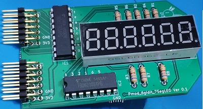
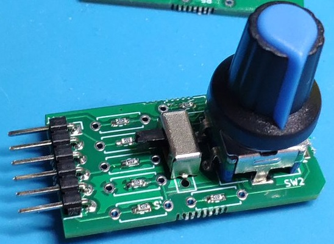

# Pmod
 Pmod boards
# KiCADのプロジェクト
各ボードは，KiCADのプロジェクトを含みます．  
ガーバーデータは 'output' ディレクトリに入っています．  
Each Pmod board directory has KiCAD project file and garber data.

写真 | ボード | 説明 | その他
---|---|---|---
 | Pmod_7Seg | 7セグLED6桁 | Pmodダブル
 | Pmod_encoder | ロータリエンコーダ | Digilent互換
 | Pmod_PLED | パワーLED | 片面アルミ基板
 | Sugamod_Matrix2 <a href="https://github.com/Lathe-Mariel/Pmod/tree/main/Pmod_Matrix2/output/output.zip">garber file</a> | 2色8x8マトリクスLED | Pmod規格外，6層基板
 | Pmod_A4988 | ステッピングモータドライバA4988
 | Pmod_7LED_8digit | 7セグLED8桁 | 4桁7セグモジュール×2個使用
 | Pmod_US_Speaker | 超音波浮揚 | 超音波トランスジューサ×6モジュール
 | Pmod_Matrix256 | 16x16マトリクスLED | 秋月横長マトリクスLED
 | Pmod_ADC | 10bit 8ch A-Dコンバータ | MCP3008/MCP3208
 | Pmod_SC1602 | 16桁2行キャラクタディスプレー | データ4ビット
 | Pmod_CAN | CAN | TJA1441AT
