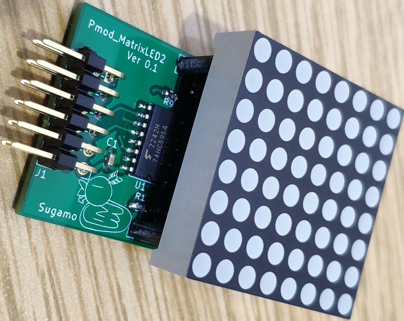

# Pmod
 Pmod boards

写真 | ボード | 説明 | その他
---|---|---|---
 | Pmod_7Seg | 7セグLED6桁 | Pmodダブル
 | Pmod_encoder | ロータリエンコーダ | Digilent互換
 | Pmod_PLED | パワーLED | 片面アルミ基板
 | Sugamod_Matrix2
<a href="https://github.com/Lathe-Mariel/Pmod/tree/main/Pmod_Matrix2/output/output.zip"garber file"> | 2色8x8マトリクスLED | Pmod規格外，6層基板
 | Pmod_A4988 | ステッピングモータドライバA4988
